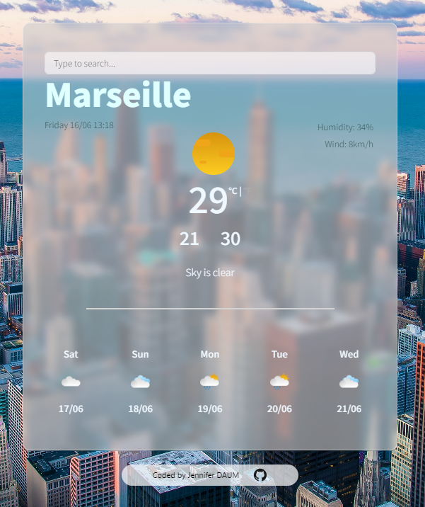

# weather-app
This weather App is a web application made via the SheCodesPlus course that provides real-time weather information for different locations. 
It allows users to search for weather details of specific cities or view their current location weather. The app displays temperature, humidity, wind speed, and a brief weather description.

## Features

- Get weather information for a specific city or current location
- Display current temperature, humidity, wind speed, and weather description
- Toggle between Celsius and Fahrenheit units
- Responsive design for desktop and mobile devices

## Technologies Used

- HTML5
- CSS3
- JavaScript (ES5)
- Axios (HTTP requests)
- SheCodes API (for weather data)
- Geolocation API (for retrieving current location)

## Getting Started
- Visit this website to test it out : https://moonlit-bienenstitch-7d42c1.netlify.app/
- Follow these instructions to get a copy of the project up and running (TBC)

## Usage

- Enter the name of a city in the search input to get weather information for that location.
- In the search bar, click on "Current Location" to retrieve weather details for your current location.
- Toggle between Celsius and Fahrenheit units by clicking on the respective unit links.

## API Key Set Up
(TBC)

## License
(TBC)

## Acknowledgments
Weather data provided by SheCodes
Geolocation support provided by Geolocation API
